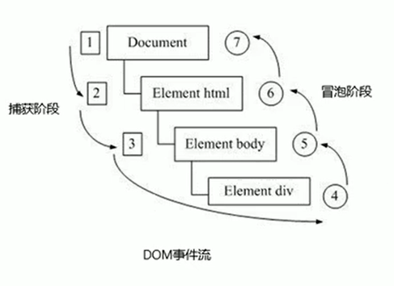
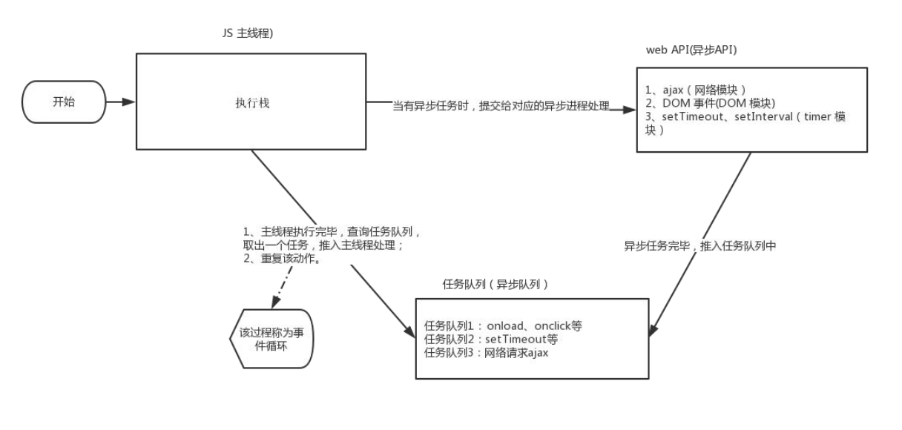
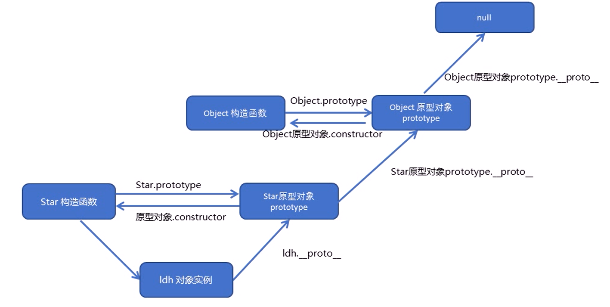

## 基本语法

#### 数据类型转换

###### 1.转换为字符串

* toString()

  > var num=1;
  >
  > alert(num.toString());

* String()强制转换

  >var num=1;
  >
  >alert(String(num));

* **加号拼接字符串:bulb:

  >var num=1;
  >
  >alert(num + '');

###### 2.转换为数字型

* parseInt(变量)   得到的是整数（向下取整）
* parseFloat(变量)   得到的是浮点数  

> parseInt('120px')会去掉px，parseFloat同

* Number()强制转换
* 隐式转换  -  *  \

###### 3.转换为布尔型

* Boolean()

  > ''、0、NaN、null、undefined会被转换成false，其余true
  
  

#### 运算符

不要直接比较两个浮点数是否相等

###### 1.比较运算符

===全等   要求值和数据类型完全相同

> 18 == '18'  //true
>
> 18 === '18'  //false

###### 2.逻辑运算符

&&优先级高于||


#### 流程控制

##### 1.switch语句

switch后面的和case后面的必须**全等**


#### 数组

创建数组：`var 数组名=[1,2,'kk',false]`

* 可以放**任意类型**数据
* arr.length数组长度:bulb:
* 可以追加元素


#### 函数

函数若没有返回值则返回undefined

##### 1.arguments的使用

不确定有多少个参数传递时，可以用arguments来获取。

是当前函数的一个**内置对象**，arguments中**存储了传递的所有实参**。

> 1. 具有length属性
>
> 2. 按照索引的方式进行存储
>
> 3. 没有pop()、push()等操作

##### 2.两种声明方式:bulb:

1. function fn(){

   }

2. 函数表达式（匿名函数）

   var	变量名 = function() {};

   调用：变量名(参数)；


#### 作用域:bulb:

注意：

1. 在函数内部，没有声明直接赋值的变量也属于全局变量（不建议使用）

2. 形参属于局部变量

3. （es6之前）没有**块级作用域**

```js
if (3 < 5){
  var num=10;
}
console.log(num);	//是可以输出的,因为不是在函数内部声明的
```


#### 预解析

> 预解析：js引擎会把js里面的所有 var 和 function 提升到当前作用域的最前面

1. 变量提升：把所有变量声明提升到当前作用域的最前面，**不提升赋值操作**
2. 函数提升：第二种声明方式（函数表达式）不会提升


#### 对象

> 由**属性**和**方法**组成

##### 创建对象的三种方式:bulb:

###### 1.利用字面量创建对象

```javascript
var obj = {
  uname: '王广凯',
  age:19;
  sayHi: function() {
		   console.log(hi);
	}
}
```

注意：

* 属性不需要声明

* 里面的属性或方法采用键值对的形式
* 多个属性或方法之间用逗号隔开
* 方法冒号后面跟的是一个匿名函数

调用对象：

1. 属性：对象名.属性名 / 对象名['属性名']

2. 方法：对象名.方法名()

###### 2.利用new Object创建对象

```js
var obj = new Object();
obj.name = '王广凯';
obj.age=19;
obj.sayhi = function(){
			  console.log(hi);
			}
```

###### 3.构造函数创建对象

function 构造函数名 (形参) {

​    this.属性 = 值；

​	this.方法 = function() {}

}

调用：**new** 构造函数名 (实参)

```javascript
functioon Student(uname,age,sex) {
  this.name = uname;
  this.age = age;
  this.sex = sex;
}
var wgk = new Student('王广凯'，19，'男');
```

##### for in 遍历对象的属性

for(变量 in 对象)

```javascript
 for(var k in obj)
 {
   console.log(obj[k]);
 }
```


#### 内置对象

> js自带的对象，并提供了一些常用的或最基本而必要的功能
>
> **查阅MDN**

##### 1.Math数学对象

> 不是一个构造函数，不需要new来调用，直接使用里面的属性和方法

* Math.PI

* Math.floor()    向下取整

* Math.ceil()    向上取整

* Math.round    四舍五入

  > .5特殊，正数负数都是往大了取

* Math.abs()    绝对值

* Math.max() / Math.min()    最大/最小值

* Math.random()随机数 [0，1）

##### 2.Date日期对象

> 是一个构造函数，**必须使用new来调用创建**

倒计时：预期的时间对应毫秒数 - 现在的时间对应毫秒数，再用毫秒计算天/时/分/秒

##### 3.Array数组对象

###### 添加数组元素

1. `arr.push(4,5)`	把4，5追加到arr数组**末尾** 	返回值是新数组长度

2. `arr.unshift(4,5)`	添加到arr数组**开头**	返回值是新数组长度

###### 删除数组元素

1. `arr.pop()`	删除最后**一个**元素	返回值是删除的元素

2. `arr.shift()`	删除第一个元素	返回值是删除的元素

###### 反转数组

​		`arr.reverse()`

###### 数组排序

```js
arr.sort(function(a,b){
			return a - b;	//升序
			return b - a;	//降序
		})
```

###### 数组索引

​		`arr.indexOf('元素')`	返回第一个满足条件的位序	找不到返回-1

###### 数组转换为字符串

​		arr = ['green' , 'blue' , 'pink'];

​		`	arr.join('-')`	括号里可以换成其他符号

​		输出：green-blue-pink

##### 4.String字符串对象

###### 根据字符返回位置

​		`str.indexOf('要查找的字符' , [起始的位置])`

###### 根据位置返回字符

* `str.charAt(索引号)`
* `str.charCodeAt(索引号)`	返回ASCII码
* `str[索引号]`	H5新增


#### 传参

简单数据类型传**值**

复杂数据类型传**址**


*********


## DOM	文档对象模型

#### DOM树

* 文档：一个页面就是一个文档，DOM种用document表示
* 元素：所有的标签，用element表示
* 结点：所有内容都是节点（标签、属性、文本、注释等），用node表示

DOM把以上内容都看作是对象

#### 获取元素

##### 1.根据ID获取

```javascript
var element = document.getElementById('id');
```

* id是大小写敏感的字符串
* 返回的是一个元素对象
* `console . dir`打印返回的元素对象，更好地查看里面的属性和方法

##### 2.根据标签名获取

```js
var elements = element.getElementsByTagName('tagName')
```

实例

```js
var table = document.getElementById("forecast-table");
var cells = table.getElementsByTagName("td");
（获取父元素内部所有指定标签名的子元素）
```

* 返回值是获取的元素对象的集合，以伪数组的形式存储（只有一个对象也是数组）
* 没有此元素返回空的伪数组
* 获取的元素是动态的

##### 3.H5新增

###### 根据类名选择

```js
var elements = element.getElementsByClassName(names);
```

###### 所有都可选:bulb:

```js
element = document.querySelector(selectors);//返回第一个元素对象
element = document.querySelectorAll(selectors);//返回所有元素对象
```

* 括号里面可以是类选择器，id选择器，标签选择器等等

##### 4.获取body元素

```js
var objRef = document.body;
```

##### 5.获取html元素

```js
var element = document.documentElement;
```


#### 事件基础

组成（三要素）：

* 事件源（被触发的对象 ）
* 事件类型（如何触发，点击/经过/键盘按下...）
* 事件处理程序（通过一个函数赋值的方式完成）

> var btn = document.getElementById(btn);
>
> btn.onclick = function(){.....};


#### 操作元素

##### 1.改变元素内容

`element.innerText`

`element.innerHTML`:bulb:

注意：只能修改普通盒子里的内容，有些特殊的要修改value

区别：innerText不识别html标签，innerHTML识别

##### 2.修改元素属性

src、href、id、alt、title等

##### 3.修改表单属性

type、value、checked、selected、disabled等

```js
var btn = document.querySelector('button');
bn.onclick = function(){
  this.disabled = true; //点击一次后被禁用
					  //this指向事件函数的调用者
}
```

##### 4.修改样式属性:bulb:

（1）`element.style`	行内样式操作

* 相当于行内样式表，权重高

> this.style.backgroundColor = "#fff";
>
> this.style.fontsize = "25px";

（2）`element.className`	类名样式操作（修改的样式比较多）

> this.className = "xxx";

* 会覆盖原来的类名
* 技巧：**可以修改为多类名，即可保留之前的类名**


#### 排他思想:bulb:

先清除所有人的样式，再给某一个单独添加效果


####  自定义属性的操作

##### 1.获取属性值

* `element.属性`	获取内置属性值（元素本身自带的）
* `element.getAttribute('属性')`	主要获得自定义的属性

##### 2.设置属性值

* `element.属性 = 值`
* `element.setAttribute('属性'，‘值’)`

##### 3.移除属性

* `element.removeAttribute('属性')`

##### 4.H5自定义属性

自定义属性以data-开头


#### 节点操作

> 利用父子兄节点关系获取元素

##### 1.父节点

`node.parentNode`	没有就返回null

##### 2.子节点	

`node.children`	不包含文本节点，所有子节点

> node.children[0]	第一个子节点

> node.children[node.children.length-1]	最后一个子节点

##### 3.兄弟节点

`node.nextElementSibling`	ie9以上

`node.previousElementSibling`

##### 4.创建并添加节点:bulb:

1. 先`document.creatElement('tagname')`

   再`node.appendChild(child)`

   > node是父级节点，下同

2. `node.insertBefore(child , 指定元素)`

###### innerHTML和document.creatElement效率比较

* innerHTML 创建多个元素（不使用拼接字符串，**采用数组形式**拼接）效率更高，结构稍复杂
* creatElement() 创建多个元素效率稍低，但是结构更清晰

##### 5.删除结点

`node.removeChild(child)`

> node是父级节点

##### 6.复制节点

`node.cloneNode()`

* 括号内为空或里面是false，浅拷贝，不复制里面的内容
* 括号里面是true，深拷贝，复制内容且动态


#### 事件高级

##### 1.注册事件

* 传统注册方式
* 事件监听方式:bulb:

`eventTarget.addEventListener( type , listener [,useCapture])`

例：button.addEventListener ( 'click' , function(){xxx;})

注：type是字符串，加 ''，不加on

​		同一个元素、同一个时间可以添加多个侦听器

##### 2.删除事件

* 传统方式	eventTarge.onclick = null
* 事件监听方式:bulb:

`eventTarget.removeEventListener( type , listener [,useCapture])`

不能使用匿名函数:bulb:

例：

```js
var divs = document.querySelectedAll( 'div' );

divs[1].addEventListener( 'click' , fn )

function fn (){
  xxxxx;
  divs[1].removeEventListener( 'click' , fn );
}
```

##### 3.DOM事件流

> 描述的是从页面中接收事件的顺序



###### 冒泡的应用：事件委托:bulb:

原理：不是给每个子节点单独设置事件监听器，而是时间监听器设置在其父节点上，

然后利用冒泡原理影响每个子节点

##### 4.事件对象

> eventTarget.addEventListener( 'click' , function(*`event`*){})
>
> 其中event就是事件对象

* 事件发生后，**跟事件相关的一系列数据的集合**都放到这个对象里面
* 系统自动创建，不用传递实参

###### 常见属性

`e.target`	返回**触发**事件的对象

`e.type`	返回事件类型（鼠标、键盘）

`e.preventDefault`	阻止默认行为（链接不跳转 、提交按钮不提交）

`e.clientX/Y`	相对于**可视区**的坐标

`e.pageX/Y`	相对于**页面文档**的坐标

**`e.stopPropagation`	阻止冒泡**


##### 5.常用鼠标事件

| 鼠标事件                       | 触发条件         |
| ------------------------------ | ---------------- |
| click                          | 鼠标点击左键触发 |
| mouseover/mouseenter(不会冒泡) | 鼠标经过触发     |
| mouseout/mouseleave(不会冒泡)  | 鼠标离开触发     |
| focus                          | 获得鼠标焦点触发 |
| blur                           | 失去鼠标焦点触发 |
| mousemove                      | 鼠标移动出发     |
| mouseup                        | 鼠标弹起触发     |
| mousedown                      | 鼠标按下触发     |

##### 6.常用键盘事件

keyup

keydown

keypress（不能识别ctrl等功能键）


*************


## BOM	浏览器对象模型

#### 对象

window对象是浏览器的顶级对象

window对象常见事件

`window.onresize = function( ){ }`

`window.addEventListener("resize",function(){});`

调整窗口大小事件


#### **定时器**:bulb:

###### 第一种

`window.setTimeout(调用函数，[延迟的毫秒数]) ;`

* window可省略

* 里面的函数被称为回调函数

* 页面中可能有很多定时器，所以经常给定时器加标识符（名字）

* 可以直接写函数，也可以写函数名（不加括号）

  > var timer1 = setTime(fn,2000);
  >
  > var timer2 = setTime(fn,3000);

停止定时器：`clearTimeout(定时器名字);`

###### 第二种

`window.setInterval(调用函数，[延迟的毫秒数]) ;`

* 每隔xx时间就调用一次回调函数
* 其他特性同上

停止定时器：`clearInterval(定时器名字);`


综合案例：京东倒计时

```html
<!DOCTYPE html>
<html lang="en">

<head>
    <meta charset="UTF-8">
    <meta name="viewport" content="width=device-width, initial-scale=1.0">
    <meta http-equiv="X-UA-Compatible" content="ie=edge">
    <title>Document</title>
    <style>
        div {
            margin: 200px;
        }
        
        span {
            display: inline-block;
            width: 40px;
            height: 40px;
            background-color: #333;
            font-size: 20px;
            color: #fff;
            text-align: center;
            line-height: 40px;
        }
    </style>
</head>

<body>
    <div>
        <span class="hour">1</span>
        <span class="minute">2</span>
        <span class="second">3</span>
    </div>
    <script>
        // 1. 获取元素 
        var hour = document.querySelector('.hour'); // 小时的黑色盒子
        var minute = document.querySelector('.minute'); // 分钟的黑色盒子
        var second = document.querySelector('.second'); // 秒数的黑色盒子
        var inputTime = +new Date('2019-5-1 18:00:00'); // 返回的是用户输入时间总的毫秒数
        countDown(); // 我们先调用一次这个函数，防止第一次刷新页面有空白 
        // 2. 开启定时器
        setInterval(countDown, 1000);

        function countDown() {
            var nowTime = +new Date(); // 返回的是当前时间总的毫秒数
            var times = (inputTime - nowTime) / 1000; // times是剩余时间总的秒数 
            var h = parseInt(times / 60 / 60 % 24); //时
            h = h < 10 ? '0' + h : h;
            hour.innerHTML = h; // 把剩余的小时给 小时黑色盒子
            var m = parseInt(times / 60 % 60); // 分
            m = m < 10 ? '0' + m : m;
            minute.innerHTML = m;
            var s = parseInt(times % 60); // 当前的秒
            s = s < 10 ? '0' + s : s;
            second.innerHTML = s;
        }
    </script>
</body>

</html>
```


#### JS执行机制:bulb:

> 同步和异步

* 同步任务	都在主线程上，形成一个**执行栈**

* 异步任务	通过回调函数实现，有以下三种类型
  * 普通事件，如click、resize
  * 资源加载，如load、error
  * 定时器

  异步任务相关回调函数添加到**任务队列**中

执行机制：

1. 先执行执行栈中的同步任务

2. 异步任务（回调函数）放入任务队列中

3. 同步任务执行完毕后，按次序读取任务队列中的异步任务，进入执行栈，开始执行



#### 立即执行函数

写法：(function( ){ })( ) ;  或  (function(){}());

第二个小括号可以看作调用函数，所以可以传参

独立创建了一个作用域，避免了命名冲突


#### location对象

##### 属性

location.href	获取或设置整个url

location.search	返回参数

......

这是最重要的两个

##### 对象

location.assign()	跟href一样，可以跳转或重定向页面，可以后退

location.replace()	替换当前页面，不能后退

location.reload	重新加载页面


#### navigator对象

#### history对象

#### offset（偏移量）系列

经常用于获得元素**位置**

| 属性                 | 作用                                                       |
| -------------------- | ---------------------------------------------------------- |
| element.offsetParent | 返回作为该元素**带有定位**的父级元素，如果都没有则返回body |
| element.offsetTop    | 返回元素相对带有定位父元素上方的偏移量                     |
| element.offsetLeft   | 返回元素相对带有定位父元素左方的偏移量                     |
| element.offsetwidth  | 返回自身包括padding、边框、内容区的宽度                    |
| element.offsetHeight | 返回自身包括padding、边框、内容区的高度                    |

* 返回的数值都不带单位
* 只能获取，**不能赋值**


#### client系列

经常用于获得**元素大小**

Width、Height不含边框，其他同上


#### scroll系列

经常用于获得**滚动距离**

| 属性                       | 作用                         |
| -------------------------- | ---------------------------- |
| element.scrollTop          | 返回被卷去的上侧距离         |
| element.scrollLeft         | 返回被卷去的左侧距离         |
| element.scrollWidth        | 返回自身实际的宽度，不含边框 |
| element.scrollHeight       | 返回自身实际的高度，不含边框 |
| **window.pageYOffset	** | 页面被卷去的高度             |

* 不含单位
* onscroll事件


*************


## 一些ES6的内容


### 原型链:bulb:

构造函数的问题：存在浪费内存的问题（每创建一个实例都会开辟一个存储空间存放同一个函数）


#### 构造函数原型：prototype

是一个**对象**，每一个构造函数都有一个prototype**属性**，可以把一些不变的方法直接定义在prototype对象上，

所有对象的实例就可以**共享这些方法**

一般情况下，公共属性定义到构造函数里面，公共方法放到原型对象身上


#### 对象原型：\__proto__

对象都会有一个属性\__proto__指向构造函数的prototype原型对象

\__proto__对象原型和原型对象prototype是等价的

不能给它赋值


#### constructor

constructor对象原型和原型对象里面都有一个constructor属性，它**指回构造函数本身**

如果修改了原来的原型对象，并且是以对象赋值的方式，则必须手动利用constructor指回原来的构造函数

> consructor:原构造函数名（加在prototype属性里）


###### 原型链::bulb:



成员查找规则：依次往上查找，直至到null

##### this的指向

构造函数和原型对象prototype this都指向对象实例


### let

1. let声明的变量具有**块级作用域**

`for`循环的计数器，就很合适使用`let`命令。

```javascript
for (let i = 0; i < 10; i++) {
  // ...
}

console.log(i);
// ReferenceError: i is not defined
```

`var`和`let`的对比：

```javascript
var a = [];
for (var i = 0; i < 10; i++) {
  a[i] = function () {
    console.log(i);
  };
}
a[6](); // 10
```

```javascript
var a = [];
for (let i = 0; i < 10; i++) {
  a[i] = function () {
    console.log(i);
  };
}
a[6](); // 6
```

##### 2.没有变量提升，所以声明必须写在前面

##### 3.暂时性死区

ES6 明确规定，如果区块中存在`let`和`const`命令，这个区块对这些命令声明的变量，从一开始就形成了**封闭作用域**。凡是在声明之前就使用这些变量，就会报错。

```javascript
var tmp = 123;

if (true) {
  tmp = 'abc'; // ReferenceError
  let tmp;
}
```


### const

`const`声明一个只读的常量。一旦声明，常量的值就不能改变。

```javascript
const PI = 3.1415;
PI // 3.1415

PI = 3;
// TypeError: Assignment to constant variable.
```

`const`实际上保证的，并不是变量的值不得改动，而是变量指向的那个**内存地址所保存的数据**不得改动。对于简单类型的数据（数值、字符串、布尔值），值就保存在变量指向的那个内存地址，因此等同于常量。但对于复合类型的数据（主要是对象和数组），变量指向的内存地址，**保存的只是一个指向实际数据的指针**，`const`只能保证这个指针是固定的（即总是指向另一个固定的地址），至于它指向的数据结构是不是可变的，就完全不能控制了。

```javascript
const a = [];
a.push('Hello'); // 可执行
a.length = 0;    // 可执行
a = ['Dave'];    // 报错
```

*******

#### 先到这吧:sleeping:

